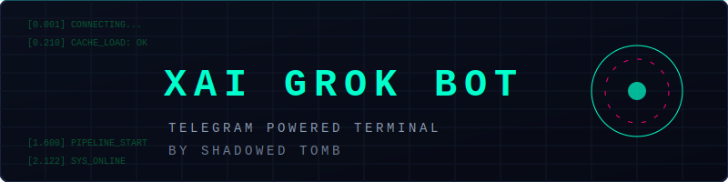

# `XAI GROK TELEGRAM BOT`



```
[SYSTEM CONFIGURATION STATUS]
=================================================================
[  0.001] INIT ENGINE .................................. [ OK ]
[  0.210] DATABASE SYNC [db.json] ....................... [ OK ]
[  0.505] LOAD OWNER_ID PROFILE ........................ [ OK ]
[  1.102] CONNECT PUTER SDK ENGINE ...................... [ OK ]
[  1.600] CONNECT FAL.AI VIDEO PIPELINE ................. [ OK ]
[  2.122] CONNECT TELEGRAM API ENGINE .................. [ OK ]
=================================================================
[ STATUS: SYSTEM ONLINE - READY FOR COMMANDS :-D ]
```

---

## `[+] CORE CAPABILITIES`

```
+---------------------------------------------------------------+
|  [CHAT]    NATURAL CONVERSATION VIA GROK-4-1-FAST             |
|  [IMAGE]   VISION ANALYSIS ON UPLOADED PHOTOS (GROK-2-VISION) |
|  [IMAGINE] PREMIUM TEXT-TO-IMAGE CREATION VIA GROK IMAGINE     |
|  [ANIMATE] IMAGE-TO-VIDEO & TEXT-TO-VIDEO (GROK AURORA)       |
|  [ADMIN]   BANS, UNBANS, AND BANNED USER LOGGING              |
|  [OWNER]   DYNAMIC ADMIN PROMOTION AND REVOCATION             |
|  [UI]      PREMIUM MONOSPACED BLOCKQUOTE TELEGRAM FORMATTING   |
+---------------------------------------------------------------+
```

---

## `[+] QUICK SETUP AND DEPLOYMENT`

### `STEP 1: INSTALL REQUIRED LIBS`
```bash
# RESTORE THE DEPENDENCIES DIRECTORY LOCALLY
npm install
```

### `STEP 2: ENVIRONMENT SCHEMA (.ENV)`
`CREATE A .ENV IN THE ROOT DIRECTORY:`
```env
TELEGRAM_BOT_TOKEN=YOUR_TELEGRAM_BOT_TOKEN
PUTER_AUTH_TOKEN=YOUR_PUTER_AUTH_TOKEN
FAL_KEY=YOUR_FAL_API_KEY
OWNER_ID=YOUR_TELEGRAM_USER_ID
TELEGRAM_API_ID=YOUR_TELEGRAM_API_ID
TELEGRAM_API_HASH=YOUR_TELEGRAM_API_HASH
```

---

## `[+] RUN BOT ENGINE`
```bash
npm start
```

---

## `[+] COMMANDS INDEX REFERENCE`

### `[+] END-USER UTILITIES`
```
/START           BOOT BOT & PRINT ROLE-TAILORED OPTIONS
/HELP            DISPLAY DETAILED ASSISTANT CAPABILITIES
/IMAGINE <TEXT>  GENERATE AI PHOTO VIA GROK-IMAGINE-QUALITY
/ANIMATE <TEXT>  GENERATE VIDEO VIA FAL (REPLY TO PHOTO FOR IMAGE-TO-VIDEO)
/RESET           ERASE CONVERSATION HISTORY MEMORY STACK
```

### `[+] ADMINISTRATIVE UTILITIES`
```
/BAN <ID/USER>   BLOCK USER ACCESS & KICK FROM GROUP CHATS
/UNBAN <ID/USER> RESTORE BOT ACCESS TO BANNED TARGET
/BANLIST         LIST ALL CURRENTLY RESTRICTED USER PROFILES
/ADMINLIST       DISPLAY LIST OF REGISTERED BOT MANAGERS
```

### `[+] OWNER-ONLY SYSTEM CONTROLS`
```
/ADDADMIN <ID>   ADD AN ACCOUNT TO THE MANAGER ACCESS LIST
/DELADMIN <ID>   STRIP ADMINISTRATIVE PRIVILEGES FROM TARGET
```

---

## `[!] DATABASE DESIGN [db.json]`
```
THE SYSTEM AUTOMATICALLY CONSTRUCTS AND SYNCS A LOCAL JSON DATABASE:
- USER ID TO USERNAME CACHE (AUTO-TRACKED ON INCOMING MESSAGES)
- ADMIN ACCESS LISTING DATA
- BANNED ACCESS LISTING DATA
```

---

## `[!] SOURCE CREDIT & CHANNEL SUPPORT`
```
=================================================================
               [!] CREDITS AND BOT SUPPORT [!]                   
                                                                 
  DEVELOPED AND DISTRIBUTED BY SHADOWED TOMB.                    
  JOIN OUR TELEGRAM CHANNEL FOR PROJECTS, SCRIPTS, AND SUPPORT:  
                                                                 
  ==> HTTPS://T.ME/SHADOWEDTOMB                                  
=================================================================
```
